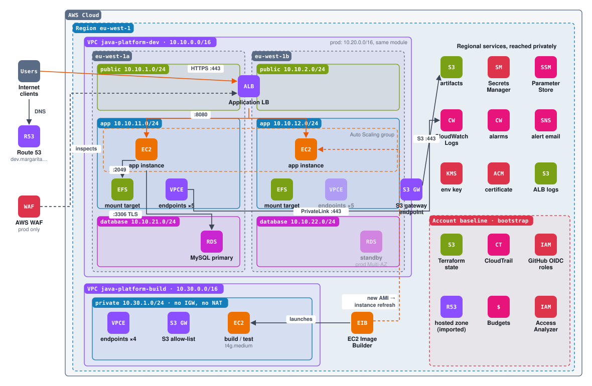
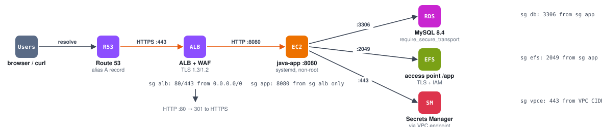
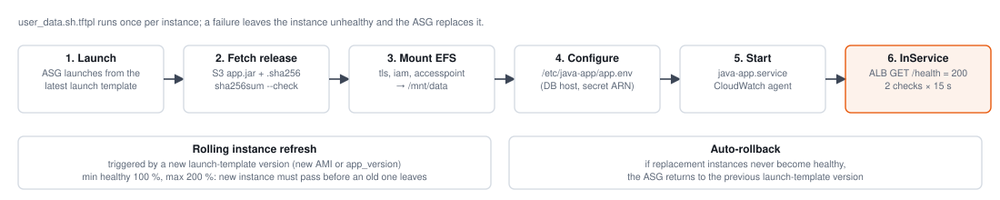
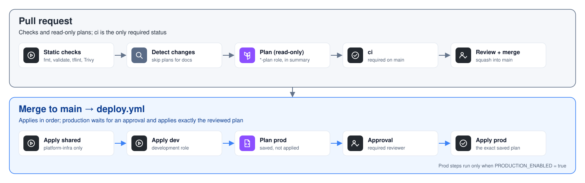

# java-infra

Runs the Java service on the platform: ALB → Auto Scaling group of Graviton
instances (java-ami) → RDS MySQL and EFS, with secrets in Secrets Manager and
access through SSM Session Manager (no SSH, no bastion).

```text
                 Route 53 ── ACM (TLS 1.3/1.2)
                     │
 internet ──► WAF ──► ALB (public subnets, HTTP→HTTPS)
                     │ :8080
                     ▼
        Auto Scaling group (private app subnets, 2 AZs)
        java-base AMI · IMDSv2 · KMS-encrypted gp3
          │            │             │
          ▼            ▼             ▼
   RDS MySQL 8.4     EFS (TLS +    VPC endpoints
   (db subnets,      IAM, access   SSM · Secrets Manager
   TLS required)     point)        CloudWatch · S3 (gateway)
```

```text
terraform/
├── modules/workload/      # everything above
└── environments/
    ├── dev/               # state workload/dev,  terraform.tfvars
    └── prod/              # state workload/prod, terraform.tfvars
```

## Diagrams

### How the four repositories fit together

<picture>
  <source media="(prefers-color-scheme: dark)" srcset="docs/diagrams/repositories.dark.svg">
  
</picture>

Each column is one repository: its workflows, the AWS services it creates, and what happens in it, in order. Repositories hand values to each other only through SSM Parameter Store.

### AWS architecture

<picture>
  <source media="(prefers-color-scheme: dark)" srcset="docs/diagrams/architecture.dark.svg">
  
</picture>

Dev environment, image build VPC and account baseline. Faded elements exist only in prod. The orange path is user traffic; the dashed orange path is a new AMI rolling into the fleet.

### Request path and security groups

<picture>
  <source media="(prefers-color-scheme: dark)" srcset="docs/diagrams/request-path.dark.svg">
  
</picture>

Route 53 resolves to the ALB, which terminates TLS and forwards to the app on 8080. Each hop is allowed by exactly one security-group rule.

### Instance boot and rolling refresh

<picture>
  <source media="(prefers-color-scheme: dark)" srcset="docs/diagrams/instance-lifecycle.dark.svg">
  
</picture>

What every new instance runs at boot, and how a new AMI or app version rolls through the fleet.

### Delivery flow

<picture>
  <source media="(prefers-color-scheme: dark)" srcset="docs/diagrams/delivery.dark.svg">
  
</picture>

Pull requests run checks and read-only plans. Merging applies dev, then (when PRODUCTION_ENABLED is true) plans prod, waits for approval and applies that exact plan.

## Inputs

Read from SSM Parameter Store, never from other repositories' state:

| Parameter | Published by |
|---|---|
| `/java-platform/{artifacts_bucket, boundary_arn}` | infra-bootstrap |
| `/java-platform/<env>/{vpc_id, *_subnet_ids, db_subnet_group_name, endpoint_sg_id, s3_prefix_list_id, kms_key_arn, acm_certificate_arn, domain_name, route53_zone_id}` | platform-infra |
| `/imagebuilder/java-platform/java-base` | java-ami |

`alert_email` comes from the `ALERT_EMAIL` environment secret, managed by infra-bootstrap.

## Design

| Pillar | Decisions |
|---|---|
| Security | Security-group chain ALB → app → RDS/EFS; no internet egress; IMDSv2 with hop limit 1; KMS-encrypted EBS, RDS, EFS, logs and SNS; RDS-managed master password in Secrets Manager, `require_secure_transport`; EFS policy enforces TLS and access only through the app's access point; IAM roles under the platform permissions boundary; WAF managed rules + per-IP rate limit (prod) |
| Reliability | 2 AZs; ELB health checks; instance refresh with launch-before-terminate and auto-rollback; Multi-AZ RDS, 14-day backups, deletion protection and final snapshot (prod); EFS backups (prod) |
| Performance | Graviton (`t4g` dev, `m7g` prod); gp3; EFS Elastic throughput; CPU target tracking |
| Cost | Dev: single instance, single-AZ `db.t4g.micro`, no WAF, short retention; storage autoscaling; EFS Infrequent Access after 30 days |
| Operations | CloudWatch agent ships app logs + memory/disk metrics; RDS error/slow logs; ALB access logs; alarms (5xx, unhealthy hosts, latency, DB CPU/storage) to SNS email |

## Releasing the application

1. Upload the build to the artifacts bucket:
   ```bash
   VERSION=0.1.0
   BUCKET=$(aws ssm get-parameter --name /java-platform/artifacts_bucket --query Parameter.Value --output text)
   sha256sum app.jar > app.jar.sha256
   aws s3 cp app.jar        s3://$BUCKET/java-app/$VERSION/app.jar
   aws s3 cp app.jar.sha256 s3://$BUCKET/java-app/$VERSION/app.jar.sha256
   ```
2. Set `app_version` in `terraform/environments/<env>/terraform.tfvars` and open a pull request.
3. Merge: dev rolls out, then prod after approval. Instances verify the checksum before starting.

The application listens on `SERVER_PORT` (8080), answers `GET /health` with 200,
and reads `DB_HOST`, `DB_PORT`, `DB_NAME` and the credentials from `DB_SECRET_ARN`
(Secrets Manager) at startup. Shared files go to `DATA_DIR` (`/mnt/data`, EFS).

## Workflows

| Workflow | Trigger | What it does |
|---|---|---|
| `pr.yml` | Pull request | fmt, validate, tflint, Trivy; read-only plans for dev and prod (skipped when nothing under `terraform/` changed); `ci` is the required check |
| `deploy.yml` | Merge to `main` | apply dev → plan prod → **approval** → apply the reviewed (encrypted) plan |
| `destroy.yml` | Manual | lift deletion protection, destroy one environment |

Production stages (prod plan on pull requests, prod plan/apply on deploy) run only when the
repository variable `PRODUCTION_ENABLED` is `true`; it is managed by infra-bootstrap (`production_enabled`).

Deploy order for a fresh account: infra-bootstrap → platform-infra → java-ami (build an image) → upload a release → java-infra.
