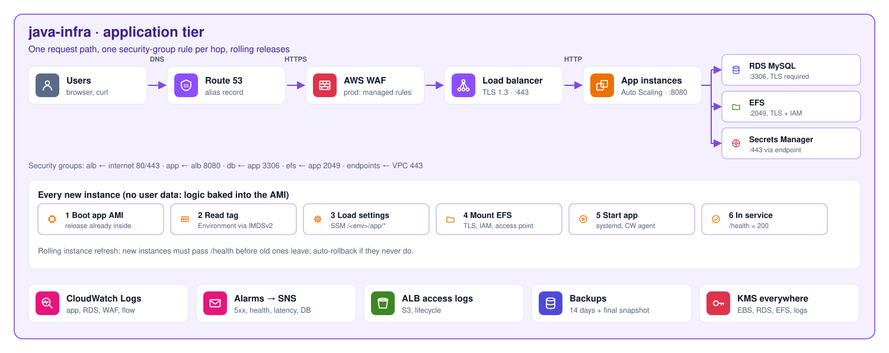

# java-infra

> Part of **[Java Platform](https://github.com/maga-zargaryan/java-platform)** · [java-app](https://github.com/maga-zargaryan/java-app) (source) · [infra-bootstrap](https://github.com/maga-zargaryan/infra-bootstrap) → [platform-infra](https://github.com/maga-zargaryan/platform-infra) → [java-ami](https://github.com/maga-zargaryan/java-ami) → **java-infra**
>
> See [java-platform](https://github.com/maga-zargaryan/java-platform) for how the four layers fit together.

Runs the Java service on the platform: ALB → Auto Scaling group of Graviton
instances (java-ami) → RDS MySQL and EFS, with secrets in Secrets Manager and
access through SSM Session Manager (no SSH, no bastion).

```text
                 Route 53 ── ACM (TLS 1.3/1.2)
                     │
 internet ──► WAF ──► ALB (public subnets, HTTP→HTTPS)
                     │ :8080
                     ▼
        Auto Scaling group (private app subnets, 2 AZs)
        app AMI (no user data) · IMDSv2 · KMS-encrypted gp3
          │            │             │
          ▼            ▼             ▼
   RDS MySQL 8.4     EFS (TLS +    VPC endpoints
   (db subnets,      IAM, access   SSM · Secrets Manager
   TLS required)     point)        CloudWatch · S3 (gateway)
```

```text
terraform/
├── modules/workload/      # everything above
└── environments/
    ├── dev/               # state workload/dev,  terraform.tfvars
    └── prod/              # state workload/prod, terraform.tfvars
```

## Diagrams

### Application tier

<picture>
  <source media="(prefers-color-scheme: dark)" srcset="docs/diagrams/workload.dark.svg">
  
</picture>

Request path with one security-group rule per hop, what every instance does at boot, and observability.

### Delivery flow

<picture>
  <source media="(prefers-color-scheme: dark)" srcset="docs/diagrams/delivery.dark.svg">
  
</picture>

Pull requests run checks and read-only plans; merging applies dev, then prod after approval using the exact reviewed plan.

Diagrams are generated by [`tools/diagrams`](https://github.com/maga-zargaryan/java-platform/tree/main/tools/diagrams) in the java-platform repository.

## Inputs

Read from SSM Parameter Store, never from other repositories' state:

| Parameter | Published by |
|---|---|
| `/java-platform/boundary_arn` | infra-bootstrap |
| `/java-platform/<env>/{vpc_id, *_subnet_ids, db_subnet_group_name, endpoint_sg_id, s3_prefix_list_id, kms_key_arn, acm_certificate_arn, domain_name, route53_zone_id}` | platform-infra |

The **AMI is not looked up**: each environment pins an exact `ami_id` (an app AMI built by java-ami, which carries the release) in its `terraform.tfvars`. There is no "latest". The AMI is validated (`Image=java-app`) and tagged `InUse-<env>` so java-ami's cleanup never deletes it.

`alert_email` comes from the `ALERT_EMAIL` environment secret, managed by infra-bootstrap.

## Outputs to instances

Instances have **no user data**. java-infra publishes the runtime settings to `/java-platform/<env>/app/{server_port, java_opts, db_host, db_port, db_name, db_secret_arn, efs_id, efs_access_point_id, log_group}`, tags each instance with `Environment`, and enables instance-metadata tags. The configurator baked into the AMI reads the tag and loads those settings at boot. The instance role may read only its own environment's prefix.

## Design

| Pillar | Decisions |
|---|---|
| Security | Security-group chain ALB → app → RDS/EFS; no internet egress; IMDSv2 with hop limit 1; KMS-encrypted EBS, RDS, EFS, logs and SNS; RDS-managed master password in Secrets Manager, `require_secure_transport`; EFS policy enforces TLS and access only through the app's access point; IAM roles under the platform permissions boundary; WAF managed rules + per-IP rate limit (prod) |
| Reliability | 2 AZs; ELB health checks; instance refresh with launch-before-terminate and auto-rollback; Multi-AZ RDS, 14-day backups, deletion protection and final snapshot (prod); EFS backups (prod) |
| Performance | Graviton (`t4g` dev, `m7g` prod); gp3; EFS Elastic throughput; CPU target tracking |
| Cost | Dev: single instance, single-AZ `db.t4g.small`, no WAF, short retention; storage autoscaling; EFS Infrequent Access after 30 days |
| Operations | CloudWatch agent ships app logs + memory/disk metrics; RDS error/slow logs; ALB access logs; alarms (5xx, unhealthy hosts, latency, DB CPU/storage) to SNS email |

## Releasing and promoting

A release is an exact AMI, moved through the environments by pull request:

1. **Release** in [java-app](https://github.com/maga-zargaryan/java-app): push a version tag. Its pipeline builds,
   tests and uploads the JAR; a pull request in java-ami bakes it in.
2. **Image**: merging that pull request builds and tests the app AMI; the build summary shows its ID.
3. **Dev**: set `ami_id` in `terraform/environments/dev/terraform.tfvars` by pull request and merge it.
   Dev rolls to the new AMI (health checks, auto-rollback).
4. **Prod**: copy dev's `ami_id` to `terraform/environments/prod/terraform.tfvars` by pull request; merging it
   and approving `production` makes prod run exactly the image dev ran.

Rollback: set `ami_id` back to the previous AMI and merge.

The application listens on `SERVER_PORT` (8080), answers `GET /health` with 200,
and reads `DB_HOST`, `DB_PORT`, `DB_NAME` and the credentials from `DB_SECRET_ARN`
(Secrets Manager) at startup. Shared files go to `DATA_DIR` (`/mnt/data`, EFS).

## Workflows

| Workflow | Trigger | What it does |
|---|---|---|
| `pr.yml` | Pull request | fmt, validate, tflint, Trivy; read-only plans for dev and prod (skipped when nothing under `terraform/` changed); `ci` is the required check |
| `deploy.yml` | Merge to `main` | apply dev and wait for a healthy rollout (instance refresh + `/health`) → plan prod (stored in the private plan bucket) → **approval** → apply that exact plan, then delete it |
| `destroy.yml` | Manual | lift deletion protection, destroy one environment |

Production stages (prod plan on pull requests, prod plan/apply on deploy) run only when the
repository variable `PRODUCTION_ENABLED` is `true`; it is managed by infra-bootstrap (`production_enabled`).

Deploy order for a fresh account: infra-bootstrap → platform-infra → java-ami (build an image) → upload a release → java-infra.
